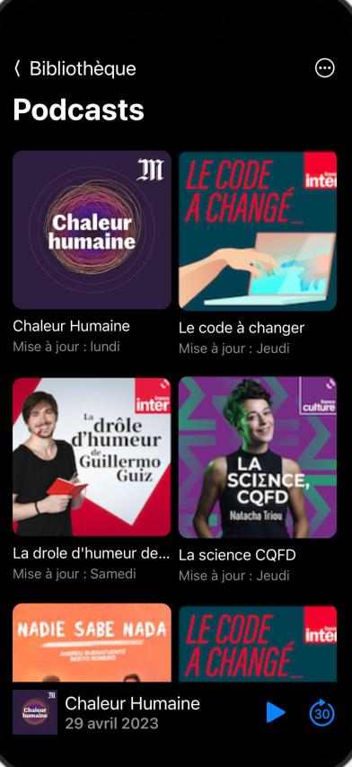

# iOS Podcast Application

## Views

| Podcasts list | Podcast view | Podcast view | Podcasts list |
| :---: | :---: | :---: | :---: |
|  |  |  |  |

## Installation

1.  Clone this repository.
2.  Open the project in Xcode.
3.  Build and run the application on an iOS simulator or device.

## Author 

Najlae LAMBARAA